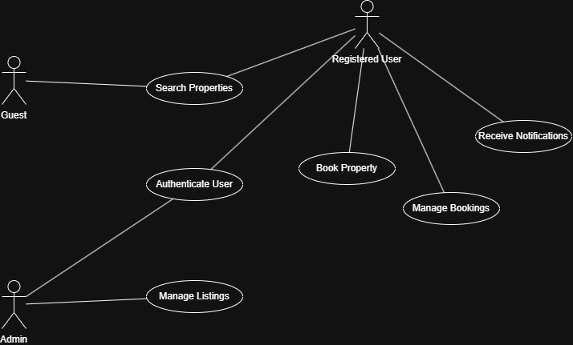

# Requirement Analysis in Software Development

## Introduction

This repository serves as a comprehensive guide and documentation hub for mastering Requirement Analysis in the Software Development Lifecycle (SDLC). It focuses on systematically gathering, analyzing, and defining both functional and non-functional requirements to lay a strong foundation for successful software projects.

The project simulates a real-world scenario through a case study of a booking management system, emphasizing best practices, clear documentation, and visual representations like use case diagrams. The aim is to help developers learn how to produce industry-standard requirement analysis artifacts that align with business and user goals.

## What is Requirement Analysis?

Requirement Analysis is a critical phase in the Software Development Lifecycle (SDLC) where the project team works to gather, examine, and define the needs and expectations of stakeholders for a software system. This process ensures that everyone involved has a clear, shared understanding of what the software must achieve.

### Why is Requirement Analysis important?

- **Clarity & Alignment:** It minimizes ambiguity by capturing precise requirements, aligning stakeholders and developers on what needs to be built.
- **Scope Definition:** Clearly defines the scope of the project, helping avoid scope creep and uncontrolled changes during development.
- **Foundation for Design & Development:** It acts as the blueprint for designing system architecture and planning the development work.
- **Accurate Estimations:** Helps in estimating costs, timeframes, and required resources more reliably.
- **Quality Assurance:** Ensures that the final software product meets the agreed-upon requirements, resulting in higher customer satisfaction and fewer costly changes later.

Without thorough Requirement Analysis, software projects risk missing core needs, running over budget, or failing to deliver expected value. This phase is therefore essential to delivering high-quality, maintainable, and scalable software solutions.

## Why is Requirement Analysis Important?

Requirement Analysis is one of the most crucial phases of the software development lifecycle. It serves as the foundation upon which successful projects are built. Here are three key reasons why it is so important:

1. **Defines Clear Scope and Prevents Scope Creep**
   - By thoroughly analyzing and documenting requirements, the project scope becomes well-defined. This minimizes the chances of scope creep, where unplanned features or changes disrupt timelines and budgets.

2. **Improves Cost and Time Estimation**
   - A detailed understanding of what needs to be developed allows teams to provide more accurate estimates for costs, resources, and schedules. This leads to better planning and resource allocation throughout the project.

3. **Ensures High-Quality Deliverables and Customer Satisfaction**
   - Clearly defined and validated requirements help ensure that the final product meets user expectations and business goals. This reduces costly rework, ensures quality, and results in higher customer satisfaction.

By investing time and effort into Requirement Analysis, organizations set the stage for smoother development, fewer misunderstandings, and more successful project outcomes.

## Key Activities in Requirement Analysis

Requirement Analysis is a structured process involving several key activities to ensure that software requirements are thoroughly understood, documented, and validated. The main activities include:

### 📌 Requirement Gathering
- Conduct interviews with stakeholders to capture their needs and expectations.
- Use surveys and questionnaires to collect input from a broader audience.
- Observe end-users in their work environment to understand real workflows.
- Review existing systems and documents to identify current functionalities and gaps.

### ✍️ Requirement Elicitation
- Organize brainstorming sessions to generate and clarify ideas.
- Hold focus groups to gather detailed feedback from selected stakeholders.
- Build prototypes or mockups to help stakeholders visualize the future system and refine their requirements.

### 📝 Requirement Documentation
- Prepare a detailed Software Requirements Specification (SRS) document listing all functional and non-functional requirements.
- Write user stories to describe features from the user's perspective.
- Create use cases to define how different actors will interact with the system.

### 📊 Requirement Analysis and Modeling
- Prioritize requirements based on their business value and impact on the project.
- Perform feasibility analysis to assess technical, financial, and time constraints.
- Develop models such as data flow diagrams (DFDs) and entity-relationship diagrams (ERDs) to visualize system requirements.

### ✅ Requirement Validation
- Review documented requirements with stakeholders to ensure completeness and accuracy.
- Define acceptance criteria to establish when a requirement is considered successfully implemented.
- Create traceability matrices to ensure all requirements are tracked through development and testing.

These activities work together to build a solid foundation for the design, development, and delivery of high-quality software systems.

## Types of Requirements

Understanding the distinction between Functional and Non‑functional Requirements is essential when analyzing software for a booking management system.

### ⚙️ Functional Requirements
Functional requirements define *what* the system should do — the specific actions and behaviors it must support. They directly address user needs and system behaviors.

**Examples for Booking Management:**
- **Search Properties:** Users can search listings based on location, availability, price, and amenities.
- **User Registration & Authentication:** New users can sign up and log in using credentials.
- **Booking Creation:** Users can select dates, book a room, and receive booking details.
- **Booking Management:** Users can view, cancel, or modify bookings.
- **Notifications & Payment:** The system sends email or SMS booking confirmations and processes payments.

### 🛡️ Non-functional Requirements
Non-functional requirements specify *how* the system performs — describing characteristics like speed, reliability, and security.

**Examples for Booking Management:**
- **Performance:** Pages should load within 2 seconds; system supports 1,000 concurrent users with minimal latency.
- **Security:** All user data must be encrypted at rest and in transit using HTTPS/TLS.
- **Reliability & Availability:** System uptime ≥ 99.9%, with failover mechanisms in case of server outages.
- **Scalability:** Should auto‑scale to handle peak seasons like holidays.
- **Usability:** Interface must be intuitive, mobile‑friendly, and easy to navigate.
- **Maintainability:** Codebase should be modular and well-documented to facilitate updates.

---

By clearly separating *functional* from *non-functional* requirements, you ensure that the system both **does the right things** and **does them well**.

# Booking System Use Case Diagram

Below is the use case diagram for the ALX Booking System:

